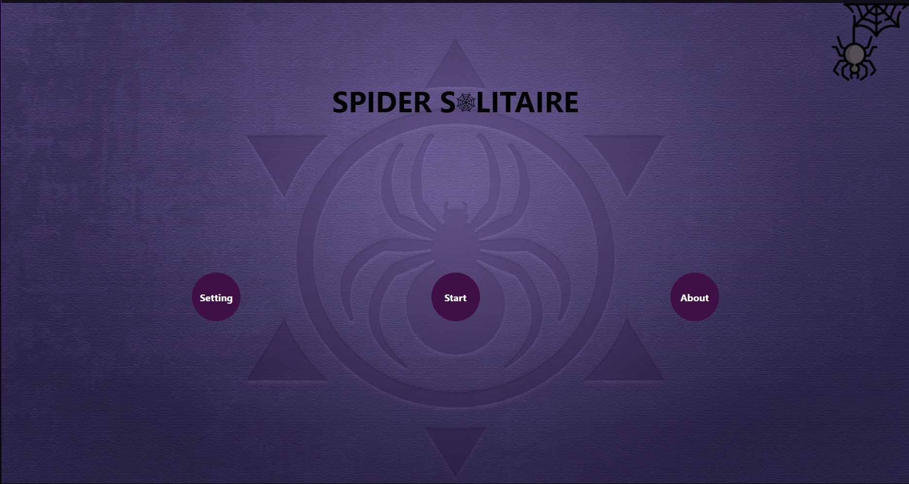
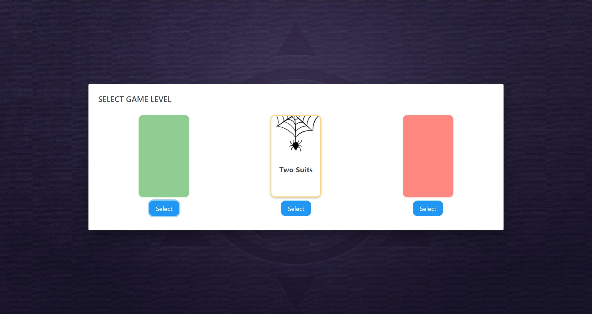
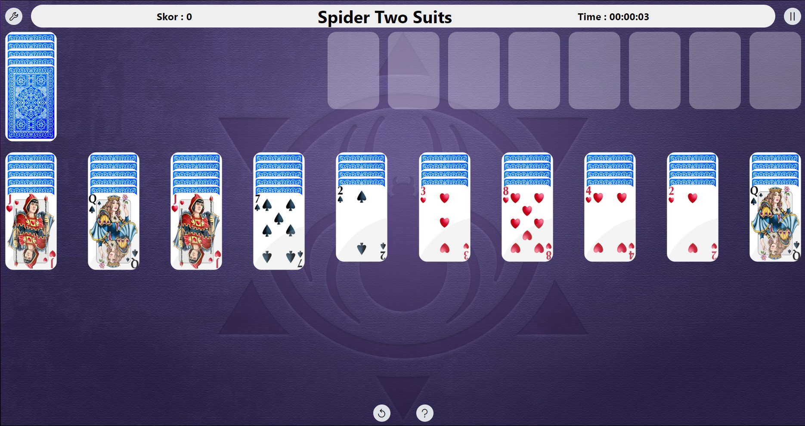
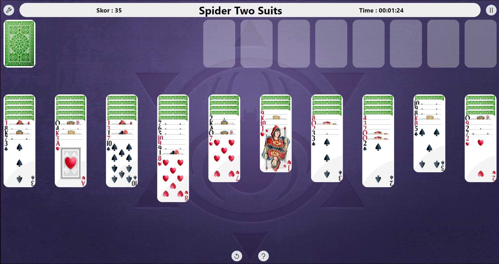
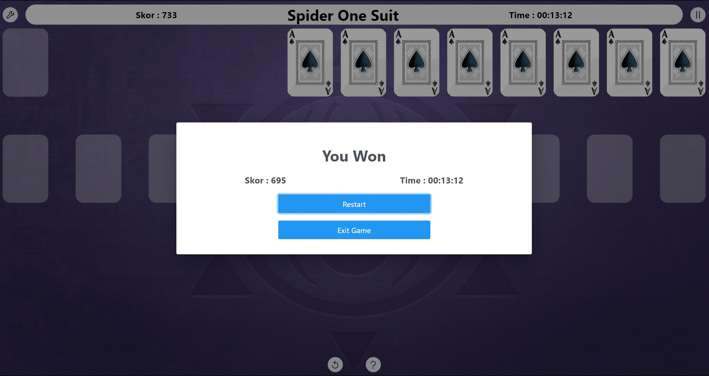

# Spider Solitaire

## Project Overview

This project is a spider solitaire game.Creating this project using Vite, I also used some libraries in the project:
- react-Dnd for drag and drop feature.
- reactprime for style.
- react-router-dom for in-game route.
- react-redux libraries for state management. 
I downloaded and used these libraries as npm install lib_name.The game in the project has 3 levels.
These games can be played as 1 suit, 2 suits and 4 suits. We can change the intermediate plan of the cards from the settings,
we can exit or continzue the game while the game is in progress, and it also has the necessary buttons to undo moves and get help in the game.
The playing rules of the game, score calculations and winning and losing situations of the game are the same as the real rules of the game.

## Project Video

[Click to watch or download the video.](./public/project_video.mp4)

## Project Images

